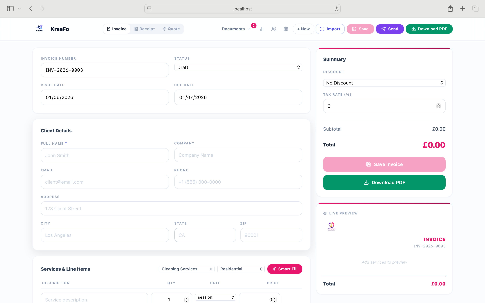
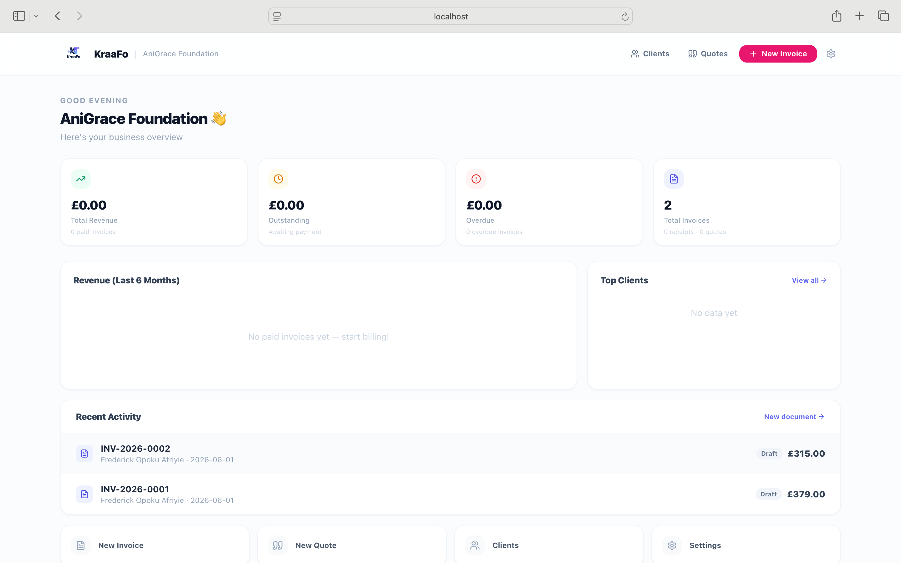
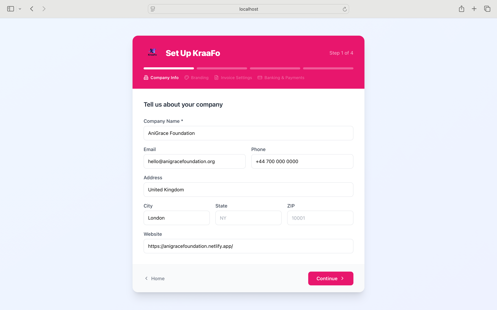

<p align="center">
  
</p>

<h1 align="center">KraaFo — Professional Invoices & Receipts</h1>

<p align="center">
  Create, brand, and deliver professional invoices, receipts, and quotes in under a minute.<br/>
  Built for freelancers and service businesses worldwide. No account required.
</p>

<p align="center">
  
  
  
  
  
  
  
</p>

---

## Screenshots

### Landing Page


### Invoice / Receipt Generator


### Business Dashboard


### Organisation Setup


---

## Features

### Documents
- **Invoice, Receipt & Quote Builder** — line items, quantities, units, discounts (flat or %), tax rate, payment tracking, due dates, notes, and terms
- **Live Preview** — see the branded PDF update in real time as you type
- **PDF Export** — pixel-perfect branded PDFs via headless Chromium (Puppeteer)
- **Document History** — all saved documents stored locally, searchable from the toolbar

### AI & Automation
- **Smart Fill** — picks your industry and client type, then suggests relevant service descriptions, line items, notes, and payment terms automatically
- **Import from Document** — upload an existing invoice or receipt (image or PDF) and the AI reads it and populates the form; falls back to local OCR if no API key is set
- **Auto Quote→Invoice** — convert a saved quote into a full invoice in one click

### Branding
- **Custom Colours** — set primary, secondary, and accent colours; every document reflects your brand
- **Logo Upload** — upload your company logo; brand colours are auto-extracted from it
- **Signature Support** — draw on screen or upload an image; appears on all generated PDFs

### Clients & Delivery
- **Client Address Book** — save and reuse client details across documents
- **Email Delivery** — send branded PDF invoices directly to clients via email (platform-managed SMTP)
- **WhatsApp & SMS** — one-tap share to WhatsApp or open in Messages (mobile-ready)
- **Quotes Management** — dedicated quotes list, status tracking (Draft → Sent → Accepted → Declined)

### Payments
- **Payment Details** — add bank account, PayPal, M-Pesa, MTN Mobile Money, Airtel Money, Telecel Cash
- **QR Code** — auto-generated payment QR on invoices linking to PayPal or mobile money

### Internationalisation
- **Multi-currency** — USD, GBP, EUR, CAD, AUD, GHS, NGN, ZAR and more
- **12+ Industries** — Cleaning, Plumbing, Electrical, Landscaping, Personal Training, Tutoring, IT Support, Photography, Pet Services, Hair & Beauty, Catering, and more

---

## Tech Stack

| Layer | Technology |
|---|---|
| Frontend | React 18, TypeScript, Vite, Tailwind CSS |
| Backend | Node.js, Express, TypeScript, ts-node-dev |
| Database | SQLite via better-sqlite3 |
| PDF Generation | Puppeteer (headless Chromium) |
| AI — Smart Fill | Groq API (Llama 3) + Gemini fallback |
| AI — Document Import | Groq vision models + pdf-parse |
| OCR Fallback | Tesseract.js (fully local, no API needed) |
| Image Processing | Sharp, node-vibrant (brand colour extraction) |
| Email Delivery | Nodemailer (platform SMTP — configured once by owner) |

---

## Getting Started

### Prerequisites

- Node.js 18+
- npm

### Installation

```bash
# Clone the repository
git clone https://github.com/your-username/krafo.git
cd krafo

# Install all dependencies (frontend + backend)
npm run install:all
```

### Environment Setup

```bash
cp server/.env.example server/.env
```

Open `server/.env` and fill in your values:

```env
PORT=3001
NODE_ENV=development
UPLOAD_DIR=./uploads
DB_PATH=./data/krafo.db

# AI — Smart Fill (optional, falls back to built-in templates)
# Get a free key at console.groq.com
GROQ_API_KEY=your_groq_key_here

# AI — Document Import vision model (optional)
GEMINI_API_KEY=your_gemini_key_here

# Platform SMTP — set once, all client emails route through here
# For Gmail: create an App Password at myaccount.google.com/apppasswords
SMTP_HOST=smtp.gmail.com
SMTP_PORT=587
SMTP_USER=your@gmail.com
SMTP_PASS=your_app_password_here
SMTP_FROM=your@gmail.com
```

> The app runs fully without any API keys. Smart Fill uses built-in templates, document import falls back to local OCR, and email can be configured later.

### Run in Development

```bash
# Start both frontend and backend together
npm run dev
```

| Service | URL |
|---|---|
| Frontend | http://localhost:5173 |
| Backend API | http://localhost:3001 |

Or run separately:

```bash
npm run dev:server   # backend only
npm run dev:client   # frontend only
```

---

## Project Structure

```
krafo/
├── client/                        # React frontend (Vite)
│   ├── src/
│   │   ├── components/
│   │   │   ├── Logo.tsx           # KraaFo logo component
│   │   │   └── SignaturePad.tsx   # Draw / upload signature modal
│   │   ├── pages/
│   │   │   ├── Landing.tsx        # Marketing landing page
│   │   │   ├── Setup.tsx          # Organisation setup wizard (4 steps)
│   │   │   ├── Dashboard.tsx      # Business overview + recent docs
│   │   │   ├── Generator.tsx      # Invoice / receipt / quote builder
│   │   │   ├── Clients.tsx        # Client address book
│   │   │   └── Quotes.tsx         # Quotes list + status management
│   │   ├── hooks/
│   │   │   └── useOrg.ts          # Organisation data hook
│   │   └── utils/
│   │       ├── api.ts             # Typed API client
│   │       ├── cn.ts              # Tailwind class helper
│   │       └── industryData.ts    # Industry → line item map
│   └── public/
│       └── krafo-logo.png
│
├── server/                        # Express backend
│   ├── src/
│   │   ├── db/
│   │   │   └── schema.ts          # SQLite schema + auto-migrations
│   │   ├── routes/
│   │   │   ├── organizations.ts
│   │   │   ├── invoices.ts
│   │   │   ├── quotes.ts
│   │   │   ├── clients.ts
│   │   │   ├── deliver.ts         # Email / send routes
│   │   │   ├── ai.ts              # Smart Fill + document import
│   │   │   ├── pdf.ts             # PDF generation
│   │   │   ├── analytics.ts       # Dashboard metrics
│   │   │   └── upload.ts          # Logo upload + colour extraction
│   │   ├── services/
│   │   │   ├── emailService.ts    # Nodemailer (env-var SMTP)
│   │   │   ├── aiService.ts       # Groq / Gemini / OCR logic
│   │   │   ├── pdfService.ts      # Puppeteer PDF rendering
│   │   │   └── imageService.ts    # Logo processing
│   │   └── templates/
│   │       └── invoiceTemplate.ts # HTML invoice / receipt template
│   └── uploads/                   # Uploaded logos (git-ignored)
│
└── docs/
    └── screenshots/               # README screenshots
```

---

## API Reference

| Method | Endpoint | Description |
|---|---|---|
| GET | `/api/health` | Server health check |
| GET | `/api/organizations/:id` | Get organisation by ID |
| POST | `/api/organizations` | Create organisation |
| PUT | `/api/organizations/:id` | Update organisation |
| GET | `/api/invoices` | List invoices / receipts |
| POST | `/api/invoices` | Create invoice / receipt |
| PUT | `/api/invoices/:id` | Update invoice / receipt |
| GET | `/api/quotes` | List quotes |
| POST | `/api/quotes` | Create quote |
| PUT | `/api/quotes/:id` | Update quote |
| GET | `/api/clients` | List clients |
| POST | `/api/clients` | Create client |
| PUT | `/api/clients/:id` | Update client |
| POST | `/api/deliver/email` | Send document via email |
| POST | `/api/ai/suggest` | Smart Fill suggestions |
| POST | `/api/ai/parse-receipt` | Import document via AI / OCR |
| GET | `/api/pdf/:invoiceId` | Download PDF |
| POST | `/api/pdf/preview` | Preview PDF inline |
| POST | `/api/upload/logo` | Upload company logo |
| GET | `/api/analytics/:orgId` | Dashboard metrics |

---

## Document Import

The Import feature accepts:

- **Images** — JPG, PNG, WebP (Groq vision AI or Tesseract local OCR)
- **PDFs** — text-based or scanned (Groq + pdf-parse or local OCR fallback)

With a Groq API key (free at [console.groq.com](https://console.groq.com)), the AI extracts client info, line items, dates, totals, notes, and payment terms in seconds. Without a key the app falls back to local OCR and pattern matching — no data leaves your machine.

---

## Roadmap

- [ ] Recurring invoice schedules
- [ ] Cloud sync / multi-device
- [ ] Stripe / PayPal payment link integration
- [ ] Client portal (view & pay invoices online)
- [ ] Multi-user / team accounts

---

## License

MIT © KraaFo
