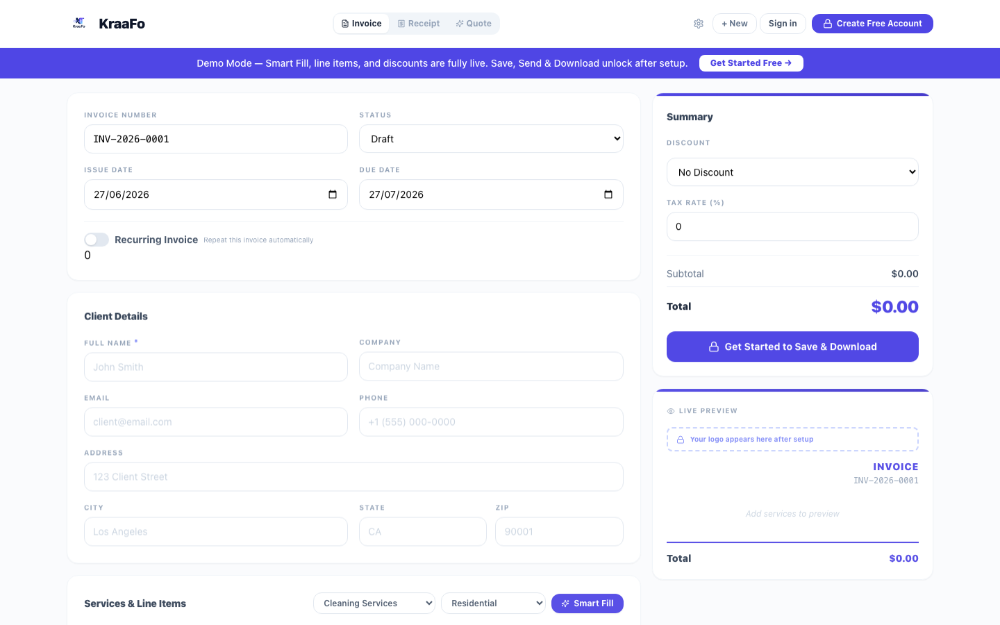
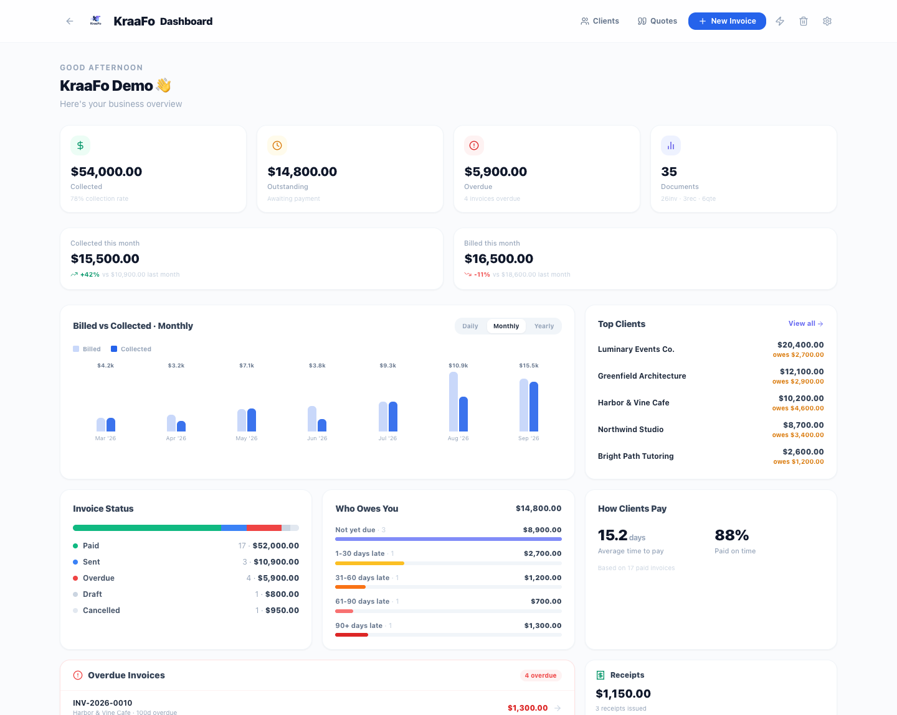
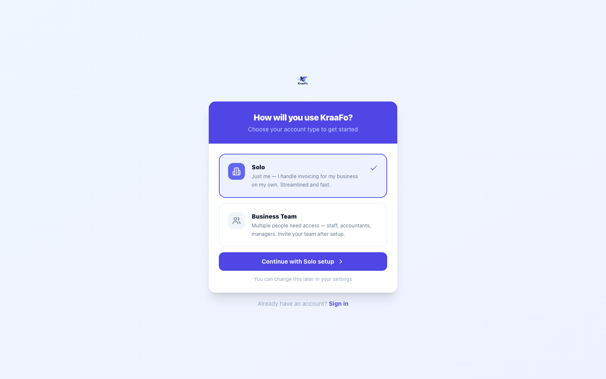

<p align="center">
  
</p>

<h1 align="center">KraaFo - Professional Invoices & Receipts</h1>

<p align="center">
  Create, brand, and deliver professional invoices, receipts, and quotes in under a minute.<br/>
  Built for freelancers and service businesses worldwide. Try the generator free - sign up to save and access from any device.
</p>

<p align="center">
  
  
  
  
  
  
  
  
  
  
</p>

---

## Screenshots

### Landing Page


### Invoice / Receipt Generator


### Business Dashboard


### Organisation Setup


---

## Features

### Documents
- **Invoice, Receipt & Quote Builder** - line items, quantities, units, discounts (flat or %), tax rate, payment tracking, due dates, notes, and terms
- **Live Preview** - see the branded PDF update in real time as you type
- **PDF Export** - pixel-perfect branded PDFs via headless Chromium (Puppeteer)
- **Mobile PDF Sharing** - on iOS and Android, download/preview triggers the native share sheet (Save to Files, WhatsApp, AirDrop, etc.) using the Web Share API
- **Document History** - all saved documents stored and searchable from the toolbar

### AI & Automation
- **Smart Fill** - picks your industry and client type, then suggests relevant service descriptions, line items, notes, and payment terms automatically (Claude → Groq → built-in templates fallback chain)
- **Import from Document** - upload an existing invoice or receipt (image or PDF) and the AI reads it and populates the form; falls back to local OCR (Tesseract.js) if no API key is set
- **Auto Quote→Invoice** - convert a saved quote into a full invoice in one click

### Branding
- **Custom Colours** - set primary, secondary, and accent colours; every document reflects your brand
- **Logo Upload** - upload your company logo; brand colours are auto-extracted from it
- **Signature Support** - draw on screen or upload an image; appears on all generated PDFs
- **Web App Manifest** - add KraaFo to your home screen (iOS & Android) and get a full-screen experience with the KraaFo icon

### Clients & Delivery
- **Client Address Book** - save and reuse client details across documents
- **Triple-Channel Delivery** - send a document to a client on WhatsApp, SMS, and Email (with PDF attachment) simultaneously in one tap; clients receive the same document across all three channels so there is no excuse for not getting it
- **Email Delivery** - branded PDF sent via Resend (or custom SMTP); works for invoices, receipts, and quotes
- **WhatsApp** - opens the client's number directly in WhatsApp with a pre-composed message; the message tells the client to check their email for the PDF
- **SMS** - opens the native Messages app with a pre-filled message containing the document summary
- **Quotes Management** - dedicated quotes list, status tracking (Draft → Sent → Accepted → Declined)

### Payments
- **Payment Details** - add bank account, PayPal, M-Pesa, MTN Mobile Money, Airtel Money, Telecel Cash
- **QR Code** - auto-generated payment QR on invoices linking to PayPal or mobile money

### Security & Monitoring
- **HTTP Security Headers** - `helmet` sets `X-Frame-Options`, `Strict-Transport-Security`, `X-Content-Type-Options`, `X-DNS-Prefetch-Control`, and `Referrer-Policy` on every response; protects against clickjacking, MIME sniffing, and protocol downgrade attacks
- **Org Isolation** - every API endpoint that creates or reads documents derives the organisation ID from the verified JWT, not from request body or query parameters; User A cannot read or write User B's data
- **CORS Allowlist** - origin matching uses exact comparison only; wildcard and prefix patterns are not used
- **Cloudflare Turnstile** - invisible/managed bot protection on the Setup page (new users), feedback form, and newsletter signup - no CAPTCHA friction for real users
- **Graceful degradation** - if Turnstile keys are not configured the forms work normally; the verification gate is skipped in development
- **Error monitoring** - Sentry captures and alerts on unhandled exceptions in both the Node server (`@sentry/node`) and the React frontend (`@sentry/react`); guarded by environment variables so it is a no-op in development unless configured
- **Frontend error boundary** - `Sentry.ErrorBoundary` wraps the entire React app; if the UI crashes the user sees a friendly "Something went wrong" fallback with a one-click reload instead of a blank screen
- **Uptime monitoring** - external uptime checks via UptimeRobot ping `/api/health` every 5 minutes; alerts sent to admin if the server goes down

### Website Analytics
- **Privacy-first page tracking** - every page view is recorded server-side via `navigator.sendBeacon`; no cookies, no third-party scripts, no personal data stored
- **Geo data** - country, region, and city resolved from IP via ip-api.com with an in-memory cache; Local/unknown IPs are filtered out
- **Bot filtering** - known crawler and bot user-agents are excluded before any data is stored
- **Session tracking** - lightweight `sessionStorage` session ID groups views from the same visit without identifying users

### Admin Dashboard (`/admin`)
- **User overview** - all registered organisations with invoice/receipt/quote counts and last-active date
- **Revenue analytics** - all-time platform revenue chart with Monthly and Yearly granularity tabs; shows cumulative growth across the entire life of the platform
- **Website analytics** - total views, unique sessions, daily bar chart (30 days), top pages, countries with flag emojis, cities, devices, browsers, referrers
- **Page drill-down** - click any page row to see every individual visit with timestamp, location, device, and browser
- **Feedback management** - all submitted ratings and comments with average score
- **Subscribers** - full subscriber list and broadcast history
- **Changelog editor** - publish and remove What's New entries visible to all users
- **Admin event alerts** - instant email notification when a new organisation signs up or creates their first invoice, including org details and a direct link to the admin panel
- **Protected by `ADMIN_TOKEN`** - all admin endpoints require `x-admin-token` header; the frontend stores the token in `sessionStorage`

### Lifecycle Emails & Engagement
- **Onboarding drip sequence** - automated email sequence (Day 2, Day 4, Day 7) guides new users through key features: branding, clients, delivery, and multi-channel sending; sent from a background scheduler that runs every hour
- **Activation milestone email** - sent automatically when a user creates their first invoice; celebrates the milestone and encourages exploring more features
- **14-day re-engagement email** - if a user signed up but has created no documents after 14 days, they receive a helpful nudge; only sent once and only to users who have not unsubscribed
- **In-app onboarding checklist** - visible on the Dashboard for new accounts; shows three completion steps (Upload logo, Create first document, Add first client); auto-hides once all steps are done; dismissable at any time
- **One-click unsubscribe** - every lifecycle email contains a unique token-based unsubscribe link; opted-out users are never sent lifecycle emails again

### Ratings & Feedback
- **Star Rating Widget** - visitors rate KraaFo (1–5 stars) and leave a comment directly on the landing page
- **Feedback Dashboard** - the owner sees all submitted reviews with average rating, individual comments, names, and dates
- **Expandable Review List** - show/collapse all reviews in the dashboard panel

### Newsletter & Broadcasts
- **Subscriber Sign-up** - email capture form on the landing page; sends a branded welcome email on subscription
- **One-click Unsubscribe** - every broadcast email contains a unique unsubscribe link (`/unsubscribe?token=...`) that opts the user out instantly
- **Broadcast Composer** - in the dashboard, write a subject and message body and send to all active subscribers in one click; supports multi-paragraph plain-text formatting
- **Send History** - recent broadcasts shown below the composer with subject line and recipient count

### SEO Landing Pages
- **6 targeted landing pages** - dedicated pages for invoice generator, receipt generator, quote generator, WhatsApp invoice, Ghana invoice (GHS + MTN MoMo), and freelance invoice; each has a unique colour theme, live 3D invoice card mockup (mouse-driven perspective tilt), animated gradient blobs, scroll-triggered section reveals, and social proof
- **Dark hero** - `#020617` background with radial gradient blobs, white dot grid, pulsing live badge, and an animated gradient headline across all landing pages and the main marketing page
- **Live mockup cards** - 3D-tilting invoice/receipt/quote mockups using a `mousemove` perspective hook to demonstrate the product without requiring sign-up

### What's New / Changelog
- **In-app changelog** - users see recent feature releases on the landing page and dashboard
- **Admin-managed** - publish and remove entries from the admin panel; no redeployment needed

### Internationalisation
- **Multi-currency** - USD, GBP, EUR, CAD, AUD, GHS, NGN, ZAR and more
- **12+ Industries** - Cleaning, Plumbing, Electrical, Landscaping, Personal Training, Tutoring, IT Support, Photography, Pet Services, Hair & Beauty, Catering, and more

---

## Tech Stack

| Layer | Technology |
|---|---|
| Frontend | React 18, TypeScript, Vite, Tailwind CSS |
| Backend | Node.js, Express, TypeScript, ts-node-dev |
| Database | SQLite via better-sqlite3 |
| PDF Generation | Puppeteer (headless Chromium) |
| AI - Smart Fill | Anthropic Claude (primary) → Groq (Llama 3) → built-in templates |
| AI - Document Import | Groq vision models + pdf-parse + Tesseract.js OCR fallback |
| Image Processing | Sharp, node-vibrant (brand colour extraction) |
| Email - Invoices | Resend API (primary) or Nodemailer (custom SMTP) |
| Email - Broadcasts | Resend API (subscriber welcome + update emails) |
| Mobile PDF | Web Share API (navigator.share) with blob-URL anchor fallback |
| Security Headers | Helmet (X-Frame-Options, HSTS, X-Content-Type-Options, Referrer-Policy) |
| Bot Protection | Cloudflare Turnstile (Managed mode - server-side verification) |
| Analytics | Custom - `navigator.sendBeacon` + ip-api.com geo + SQLite |
| Error Monitoring | Sentry (`@sentry/node` on server, `@sentry/react` on frontend) |
| Lifecycle Emails | Resend API + hourly scheduler (day2/4/7 onboarding, day14 re-engagement, activation milestone) |
| SEO | Post-build pre-renderer (`scripts/prerender.cjs`) - landing page, generator, and changelog rendered to static HTML at build time so search crawlers see full content |

---

## Getting Started

### Prerequisites

- Node.js 18+
- npm

### Installation

```bash
# Clone the repository
git clone https://github.com/fredopoku/KraaFo.git
cd KraaFo

# Install all dependencies (frontend + backend)
npm run install:all
```

### Environment Setup

```bash
cp server/.env.example server/.env
```

Open `server/.env` and fill in your values:

```env
PORT=3001
NODE_ENV=development
UPLOAD_DIR=./uploads
DB_PATH=./data/krafo.db

# Frontend URL (used in unsubscribe links inside broadcast emails)
FRONTEND_URL=https://kraafo.com

# Admin dashboard password - set a long random string
ADMIN_TOKEN=your_secret_admin_token_here

# AI - Smart Fill (optional, falls back to built-in templates)
# Primary: get a key at console.anthropic.com
ANTHROPIC_API_KEY=your_anthropic_key_here

# AI - Smart Fill fallback (optional)
# Get a free key at console.groq.com
GROQ_API_KEY=your_groq_key_here

# Email - Resend (recommended - used for invoice delivery, welcome emails, broadcasts, and lifecycle emails)
# Get a free key at resend.com
RESEND_API_KEY=your_resend_key_here
RESEND_FROM=invoices@kraafo.com

# Email - Custom SMTP (alternative to Resend, per-org configuration)
SMTP_HOST=smtp.gmail.com
SMTP_PORT=587
SMTP_USER=your@gmail.com
SMTP_PASS=your_app_password_here
SMTP_FROM=your@gmail.com

# Bot Protection - Cloudflare Turnstile (optional - forms work without it)
# Get free keys at dash.cloudflare.com → Turnstile
TURNSTILE_SECRET=your_turnstile_secret_key_here

# Error monitoring - Sentry (optional)
# Get a DSN at sentry.io → your project → Settings → Client Keys
SENTRY_DSN=https://your_key@sentry.io/your_project_id

# Admin alert email (optional - defaults to opokufred32@gmail.com)
# Receives signup notifications and key event alerts
ADMIN_ALERT_EMAIL=your@email.com
```

For the frontend, create `client/.env`:

```env
# Cloudflare Turnstile site key (optional - widget is hidden if not set)
VITE_TURNSTILE_SITEKEY=your_turnstile_site_key_here

# Sentry DSN for frontend error monitoring (optional - same DSN as server)
VITE_SENTRY_DSN=https://your_key@sentry.io/your_project_id
```

> The app runs fully without any API keys - Smart Fill uses built-in templates, document import falls back to local OCR, email features require at minimum a Resend key, and Turnstile bot protection is skipped if keys are not configured.

### Run in Development

```bash
# Start both frontend and backend together
npm run dev
```

| Service | URL |
|---|---|
| Frontend | http://localhost:5173 |
| Backend API | http://localhost:3001 |

Or run separately:

```bash
npm run dev:server   # backend only
npm run dev:client   # frontend only
```

---

## Project Structure

```
KraaFo/
├── client/                          # React frontend (Vite)
│   ├── public/
│   │   ├── krafo-logo.png
│   │   └── manifest.json            # Web App Manifest (home screen icon)
│   └── src/
│       ├── components/
│       │   ├── Logo.tsx             # KraaFo logo component (supports dark prop for inverted logo)
│       │   ├── SignaturePad.tsx     # Draw / upload signature modal
│       │   ├── StoryPlayer.tsx      # WhatsApp-Status style story player for the landing page
│       │   └── Turnstile.tsx        # Cloudflare Turnstile widget (reusable)
│       ├── pages/
│       │   ├── Landing.tsx          # Marketing page - dark hero, animated blobs, crossfade portraits, feedback widget, newsletter
│       │   ├── Setup.tsx            # Organisation setup wizard (Turnstile gate for new users)
│       │   ├── Login.tsx            # Sign-in page
│       │   ├── Join.tsx             # Team invite / join page
│       │   ├── Dashboard.tsx        # Business overview + revenue chart (daily/monthly/yearly) + onboarding checklist + feedback panel
│       │   ├── Generator.tsx        # Invoice / receipt / quote builder
│       │   ├── InvoiceView.tsx      # Hosted invoice preview (shareable via WhatsApp / SMS link)
│       │   ├── Admin.tsx            # Admin dashboard - users, analytics, feedback, subscribers
│       │   ├── Clients.tsx          # Client address book
│       │   ├── Quotes.tsx           # Quotes list + status management
│       │   ├── Trash.tsx            # Recycle bin - soft-deleted documents with restore
│       │   ├── Team.tsx             # Team member management
│       │   ├── Changelog.tsx        # What's New page
│       │   ├── Unsubscribe.tsx      # Email unsubscribe confirmation page
│       │   ├── InvoiceGeneratorPage.tsx   # SEO landing - invoice generator (indigo/violet theme)
│       │   ├── ReceiptGeneratorPage.tsx   # SEO landing - receipt generator (emerald theme)
│       │   ├── QuoteGeneratorPage.tsx     # SEO landing - quote generator (violet theme)
│       │   ├── WhatsappInvoicePage.tsx    # SEO landing - WhatsApp invoice (green/WhatsApp theme)
│       │   ├── GhanaInvoicePage.tsx       # SEO landing - Ghana invoice / GHS + MTN MoMo (indigo/amber)
│       │   └── FreelanceInvoicePage.tsx   # SEO landing - freelance invoice (violet/fuchsia theme)
│       ├── hooks/
│       │   ├── useOrg.ts            # Organisation data hook
│       │   └── use3DTilt.ts         # Mouse-driven 3D perspective tilt for invoice card mockups
│       └── utils/
│           ├── api.ts               # Typed API client (incl. mobile PDF + community APIs)
│           ├── cn.ts                # Tailwind class helper
│           ├── industryData.ts      # Industry → line item map
│           └── tracker.ts           # Privacy-first page view tracker (sendBeacon)
│
├── server/                          # Express backend
│   ├── src/
│   │   ├── db/
│   │   │   └── schema.ts            # SQLite schema (organizations, invoices, clients,
│   │   │                            #   quotes, subscribers, feedback, broadcasts,
│   │   │                            #   page_views, changelog_entries, …)
│   │   ├── middleware/
│   │   │   └── adminAuth.ts         # x-admin-token header guard for admin routes
│   │   ├── routes/
│   │   │   ├── organizations.ts
│   │   │   ├── invoices.ts
│   │   │   ├── quotes.ts
│   │   │   ├── clients.ts
│   │   │   ├── deliver.ts           # Invoice/quote email, WhatsApp delivery, payment links
│   │   │   ├── ai.ts                # Smart Fill + document import
│   │   │   ├── pdf.ts               # PDF generation + serving
│   │   │   ├── analytics.ts         # Dashboard KPI metrics (per-org); revenue chart with daily/monthly/yearly granularity, all-time data
│   │   │   ├── track.ts             # Privacy-first website page view tracking
│   │   │   ├── admin.ts             # Admin endpoints - users, site analytics, views drill-down
│   │   │   ├── upload.ts            # Logo upload + colour extraction
│   │   │   ├── feedback.ts          # Star ratings + feedback submission (Turnstile protected)
│   │   │   ├── subscribers.ts       # Newsletter subscribe / unsubscribe (Turnstile protected)
│   │   │   ├── broadcasts.ts        # Send update emails to all subscribers
│   │   │   └── changelog.ts         # What's New entries (admin create/delete, public read)
│   │   ├── services/
│   │   │   ├── emailService.ts      # Invoice delivery + welcome + broadcasts + lifecycle emails (activation, day14, admin alerts) via Resend
│   │   │   ├── scheduler.ts         # Hourly cron - fires day2/4/7 onboarding sequence, day14 re-engagement for inactive users
│   │   │   ├── aiService.ts         # Claude / Groq / OCR logic
│   │   │   ├── pdfService.ts        # Puppeteer PDF rendering
│   │   │   └── imageService.ts      # Logo processing + colour extraction
│   │   ├── utils/
│   │   │   └── turnstile.ts         # Cloudflare Turnstile server-side verification helper
│   │   └── templates/
│   │       └── invoiceTemplate.ts   # HTML invoice / receipt / quote template
│   └── uploads/                     # Uploaded logos & signatures (git-ignored)
│
├── scripts/
│   └── prerender.cjs                # Post-build SEO pre-renderer (puppeteer-core)
└── docs/
    └── screenshots/                 # README screenshots
```

---

## API Reference

### Core

| Method | Endpoint | Description |
|---|---|---|
| GET | `/api/health` | Server health check |
| GET | `/api/organizations/:id` | Get organisation by ID |
| POST | `/api/organizations` | Create organisation |
| PUT | `/api/organizations/:id` | Update organisation |
| GET | `/api/invoices` | List invoices / receipts (filterable by type, status, client) |
| POST | `/api/invoices` | Create invoice / receipt |
| PUT | `/api/invoices/:id` | Update invoice / receipt |
| DELETE | `/api/invoices/:id` | Delete invoice / receipt |
| GET | `/api/quotes` | List quotes |
| POST | `/api/quotes` | Create quote |
| PUT | `/api/quotes/:id` | Update quote |
| POST | `/api/quotes/:id/convert` | Convert quote to invoice |
| DELETE | `/api/quotes/:id` | Delete quote |
| GET | `/api/clients` | List clients (supports search) |
| POST | `/api/clients` | Create client |
| PUT | `/api/clients/:id` | Update client |
| DELETE | `/api/clients/:id` | Delete client |

### Delivery & PDF

| Method | Endpoint | Description |
|---|---|---|
| POST | `/api/deliver/email/:invoiceId` | Send document PDF via email (invoices, receipts, and quotes) |
| GET | `/api/deliver/whatsapp/:invoiceId` | Get WhatsApp share link |
| GET | `/api/deliver/payment-links/:invoiceId` | Get payment method details |
| POST | `/api/deliver/generate-dkim` | Generate DKIM key pair |
| POST | `/api/deliver/test-email` | Send a test email |
| GET | `/api/pdf/:invoiceId` | Download or preview invoice PDF |
| GET | `/api/pdf/quote/:quoteId` | Download or preview quote PDF |

### AI & Upload

| Method | Endpoint | Description |
|---|---|---|
| GET | `/api/ai/status` | Check if AI is enabled |
| POST | `/api/ai/suggest` | Smart Fill - suggest line items and terms |
| POST | `/api/ai/enhance` | Improve a line item description |
| POST | `/api/ai/parse-receipt` | Import document via AI / OCR |
| POST | `/api/upload/logo` | Upload company logo + extract brand colours |
| GET | `/api/analytics` | Dashboard KPI metrics (per-org); accepts `?granularity=daily\|monthly\|yearly` for revenue chart (daily = last 90 days, monthly/yearly = all time) |

### Tracking & Analytics

| Method | Endpoint | Description |
|---|---|---|
| POST | `/api/track` | Record a page view (bot-filtered, geo-resolved) |

### Admin (requires `x-admin-token` header)

| Method | Endpoint | Description |
|---|---|---|
| GET | `/api/admin/users` | All organisations with usage stats |
| GET | `/api/admin/analytics` | Site-wide analytics - overview, countries, cities, daily chart, pages, devices, browsers, referrers |
| GET | `/api/admin/analytics/views` | Individual page view records (filterable by page, paginated) |

### Community

| Method | Endpoint | Description |
|---|---|---|
| POST | `/api/feedback` | Submit a star rating + message (Turnstile protected) |
| GET | `/api/feedback` | List all feedback with average rating |
| GET | `/api/feedback/highlights` | Top-rated feedback highlights for the landing page |
| POST | `/api/subscribers` | Subscribe an email to updates (Turnstile protected) |
| GET | `/api/subscribers` | List all active subscribers |
| GET | `/api/subscribers/unsubscribe/:token` | Unsubscribe via token from email link |
| POST | `/api/broadcasts` | Send a broadcast email to all subscribers |
| GET | `/api/broadcasts` | List recent broadcast history |
| GET | `/api/changelog` | List published What's New entries |
| POST | `/api/changelog` | Publish a new changelog entry (admin only) |
| DELETE | `/api/changelog/:id` | Remove a changelog entry (admin only) |

---

## Document Import

The Import feature accepts:

- **Images** - JPG, PNG, WebP (Groq vision AI or Tesseract local OCR)
- **PDFs** - text-based or scanned (Groq + pdf-parse or local OCR fallback)

With an Anthropic or Groq API key, the AI extracts client info, line items, dates, totals, notes, and payment terms in seconds. Without a key the app falls back to local OCR and pattern matching - no data leaves your machine.

---

## Bot Protection

KraaFo uses [Cloudflare Turnstile](https://www.cloudflare.com/products/turnstile/) for bot protection - a privacy-friendly alternative to CAPTCHA that is invisible to real users.

Protected surfaces:
- **Setup page** - new users see a one-time verification before the setup wizard loads
- **Feedback form** - prevents spam ratings
- **Newsletter signup** - prevents fake subscriptions

Server-side verification uses the `TURNSTILE_SECRET` environment variable. If the secret is not set the check is skipped (development mode). If Cloudflare is unreachable the request is allowed through (fail-open).

---

## Roadmap

- [x] Invoice, Receipt & Quote builder
- [x] AI Smart Fill & document import
- [x] Email & WhatsApp delivery
- [x] Mobile PDF sharing (Web Share API)
- [x] Client ratings & feedback system
- [x] Newsletter subscription & broadcast emails
- [x] Changelog / What's New page
- [x] Bot protection (Cloudflare Turnstile)
- [x] Privacy-first website analytics
- [x] Admin dashboard (users, analytics, feedback, subscribers, changelog)
- [x] Recurring invoice schedules
- [x] Multi-user / team accounts
- [x] Triple-channel delivery (WhatsApp + SMS + Email simultaneously)
- [x] Security hardening (org isolation, CORS exact-match, HTTP security headers)
- [x] Multi-device access (sign in from any browser or device - data lives on the server)
- [x] SEO pre-rendering (landing page, generator, changelog served as static HTML at build time)
- [x] 6 SEO long-tail landing pages with dark hero, 3D tilt mockups, and scroll-triggered reveals
- [x] Lifecycle email sequences (Day 2/4/7 onboarding, Day 14 re-engagement, activation milestone)
- [x] In-app onboarding checklist for new users
- [x] All-time revenue analytics with Daily / Monthly / Yearly granularity
- [x] Error monitoring (Sentry - server + React frontend)
- [x] Uptime monitoring (UptimeRobot)
- [x] Admin real-time alerts (signup, first invoice)
- [ ] Stripe / PayPal payment link integration
- [ ] Client portal (view & pay invoices online)
- [ ] Feature request voting board

---

## License

MIT © Frederick Opoku Afriyie
